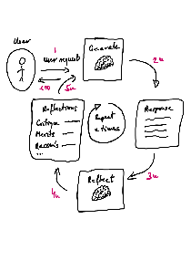

# Chatbot-design-patterns

🚧 *Repo under construction...* 🦺

In this repo, the following design patterns are 

1. CoT - Chain-of-Thought

2. ReAct - Reasoning and Acting

3. Reflexion - Self-reflecting agent

4. LATS - Language Agent Tree Search

## 1. Grokking LangChain and LangGraph

## 2. Chatbot design patterns

### 2.1. CoT - Chain-of-Thought

See [chain_of_thought](https://github.com/szalmaf/Chatbot-design-patterns/blob/main/chain_of_thought_CoT.py)

### 2.2. ReAct - Reasoning and Acting

### 2.3. Reflexion - Self-reflecting agent

See [reflexion.py](https://github.com/szalmaf/Chatbot-design-patterns/blob/main/reflexion.py)

### 2.4. LATS - Language Agent Tree Search

